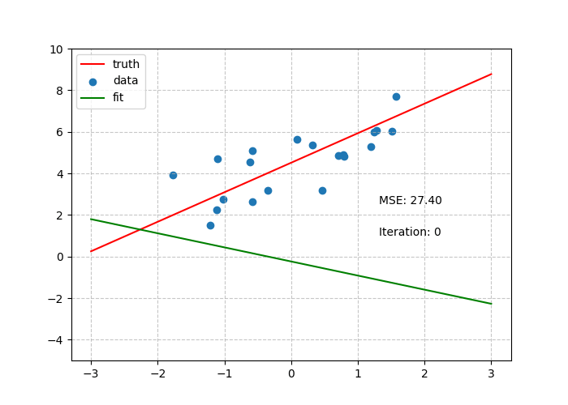

# 线性回归

首先让我们用Python生成一系列数据点，这些数据点为一个线性函数加上一个高斯噪声。我们可以用[matplotlib](https://matplotlib.org/)将这些数据点与真实函数都可视化出来，这里我们随便写一个线性函数：

$$
f(x)=1.42x + 4.51
$$


```python
import numpy as np
import matplotlib.pyplot as plt

def f(x):
    return 1.42 * x + 4.51

xs = np.random.randn(20)
ys = np.array([f(x) + np.random.randn() for x in xs])

plt.figure(figsize=(7, 5))
plt.plot(np.linspace(-3, 3, 100), f(np.linspace(-3, 3, 100)), color='red')
plt.scatter(xs, ys)
plt.grid(linestyle="--", alpha=0.7)
plt.show()
```

由于这里引入了随机数，并且没设置随机数种子，故跑出来的图因人而异。

假设我们并不知道这里的函数是什么，但我们根据数据点的分布可以合理推测其为线性函数，故问题可以转化为找到一组线性模型的最优参数使其能最好地拟合数据。

设 $f(x) = ax+b$，这里我们的数据集有20个数据点，即我们有 $D=\{(x_{i},y_{i})\}_{i=1}^{20}$，假设有函数 $\mathcal{L}(f, D)$ 反映了 $f$ 拟合 $D$ 的优劣，其函数值越小拟合得越好，那么我们就可以把问题写成如下的优化问题：

$$
\begin{gather*}
\min_{a,b}\mathcal{L}(f(\cdot; a, b), D)\\
s.t. \quad a,b \in\mathbb{R}
\end{gather*}
$$

如果不乱选 $\mathcal{L}$ 的话，这已经是最简单的优化问题了。这里我们采用常规的均方误差，即：

$$
\begin{align*}
\mathcal{L}(f, D) &= \frac{1}{20}\sum\limits_{i=1}^{20}(f(x_{i})-y_{i})^{2}\\
&= \frac{1}{20}\sum\limits_{i=1}^{20}(ax_{i}+b-y_{i})^{2}
\end{align*}
$$

使用最小二乘法，我们可以直接求出该问题的解析解：

$$
a^{*}=\frac{\sum\limits_{i=1}^{20}(x_{i}-\overline{x})(y_{i}-\overline{y})}{\sum\limits_{i=1}^{20}(x_{i}-\overline{x})^{2}}, \quad b^{*}=\overline{y}-\overline{x}a^{*}
$$

用Python进行计算并在图中与实际值对比：

```python
def mse(xs, ys, a, b):
    return np.mean((ys - a * xs - b) ** 2)

def least_squares(xs, ys):
    x_mean = np.mean(xs)
    y_mean = np.mean(ys)
    a = np.sum((xs - x_mean) * (ys - y_mean)) / np.sum((xs - x_mean) ** 2)
    b = y_mean - a * x_mean
    return a, b

a, b = least_squares(xs, ys)
plt.figure(figsize=(7, 5))
plt.plot(np.linspace(-3, 3, 100), f(np.linspace(-3, 3, 100)), color='red', label="truth")
plt.scatter(xs, ys, label="data")
plt.plot(np.linspace(-3, 3, 100), a * np.linspace(-3, 3, 100) + b, color='green', label="fit")
plt.grid(linestyle="--", alpha=0.7)
plt.legend()
plt.show()
print("MSE:", mse(xs, ys, a, b))
```

由于数据中存在噪声，拟合出的函数与真实函数仍会有不可避免的一点偏差，但已十分接近。

在实际生产环境中，几乎不存在这么简单的问题，可以直接求出解析解。我们模型假设也不会像线性模型这么简单，否则往往会导致欠拟合等问题。故而，我们需要一种算法，不管面对何种损失函数 $\mathcal{L}$ 与模型 $f$，都能使模型参数尽可能逼近最优解。

梯度下降系列算法几乎就是我们需要的算法了，只要损失函数可微，我们就能求梯度，然后让模型参数往梯度下降的方向走一小步，使得损失函数值下降。具体而言，算法分为如下步骤：

1. 选定损失函数 $\mathcal{L}$，模型 $f$，模型参数为 $\theta$，学习率为 $\tau$。
2. 随机初始化模型参数 $\theta_{0}$。
3. 在第 $t$ 步，计算 $\nabla_{\theta}\mathcal{L}(t-1)$，更新参数 $\theta_{t}\leftarrow \theta_{t-1}-\tau\nabla_\theta\mathcal{L}(t-1)$

在上述线性回归任务中，梯度十分容易计算：

$$
\frac{\partial \mathcal{L}}{\partial a}=\frac{1}{10}\sum\limits_{i=1}^{20}x_{i}(ax_{i}+b-y_{i}),\quad \frac{\partial \mathcal{L}}{\partial b}=\frac{1}{10}\sum\limits_{i=1}^{20}(ax_{i}+b-y_{i})
$$

我们可以快速写出如下梯度下降的代码：

```python
def gradient_descent(xs, ys, a, b, lr):
    a_grad = 2 * np.mean(xs * (a * xs + b - ys))
    b_grad = 2 * np.mean(a * xs + b - ys)
    a -= lr * a_grad
    b -= lr * b_grad
    return a, b
```

通过一些可视化，我们可以看到梯度下降算法的运行情况：

```python
from matplotlib.animation import FuncAnimation
a_init, b_init = np.random.randn(), np.random.randn()

lr = 0.05
n_iter = 30
history = []
fig, ax = plt.subplots(figsize=(7, 5))

x = np.linspace(-3, 3, 100)

for i in range(n_iter):
    history.append((a_init, b_init))
    a_init, b_init = gradient_descent(xs, ys, a_init, b_init, lr)


def update(num, ab, ax):
    a, b = ab[num][0], ab[num][1]
    ax.clear()
    ax.set_ylim(-5, 10)
    ax.plot(x, f(x), color="red", label="truth")
    ax.scatter(xs, ys, label="data")
    ax.plot(x, a * x + b, color="green", label="fit")
    ax.grid(linestyle="--", alpha=0.7)
    ax.text(0.7, 0.5, f"MSE: {mse(xs, ys, a, b):.2f}", transform=ax.transAxes)
    ax.text(0.7, 0.4, f"Iteration: {num}", transform=ax.transAxes)
    ax.legend()
    return ax


ani = FuncAnimation(fig, update, frames=len(history), fargs=(history, ax), blit=False, interval=100)
ani.save("linear_regression.gif", writer="pillow")
```



可以看到，在合理设置超参数后，梯度下降算法也逼近了最优解，同时相比求出解析解大大减少了心智负担。另外，虽然使用全部数据进行梯度下降能够更稳定地收敛到最优解，但数据集过大时往往会造成计算效率大大降低，因此还有着小批次梯度下降与随机梯度下降等变体。深度学习中常提到的SGD虽然有着S开头，但往往指的是小批次梯度下降而非随机梯度下降。

小批次梯度下降就是每次计算时只用一小批数据计算损失函数获得梯度，随机梯度下降则是每次只选一个数据进行计算。可以预见到，这两种方法都可能导致算法稳定性下降。当然，也有[研究](https://arxiv.org/abs/1509.01240)指出，SGD可能会使模型获得更好的泛化能力，毕竟在训练集上拟合得较好的模型也不一定能在训练集分布之外的数据上表现良好。
